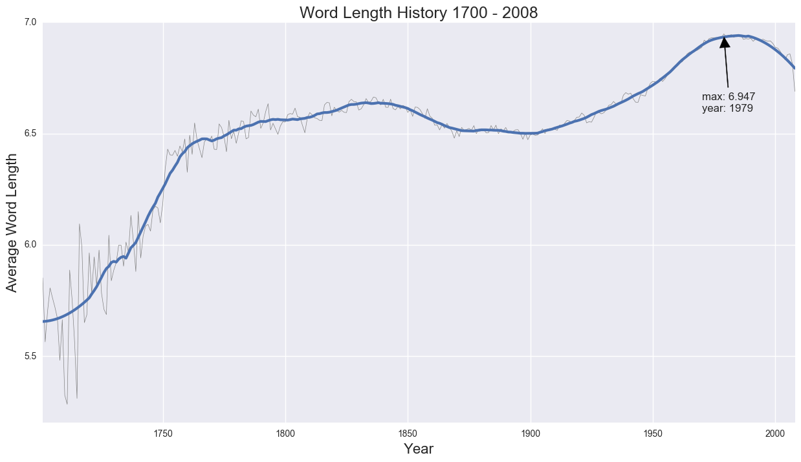
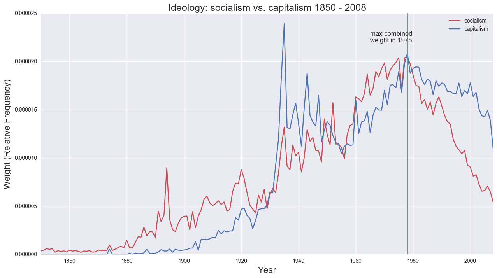
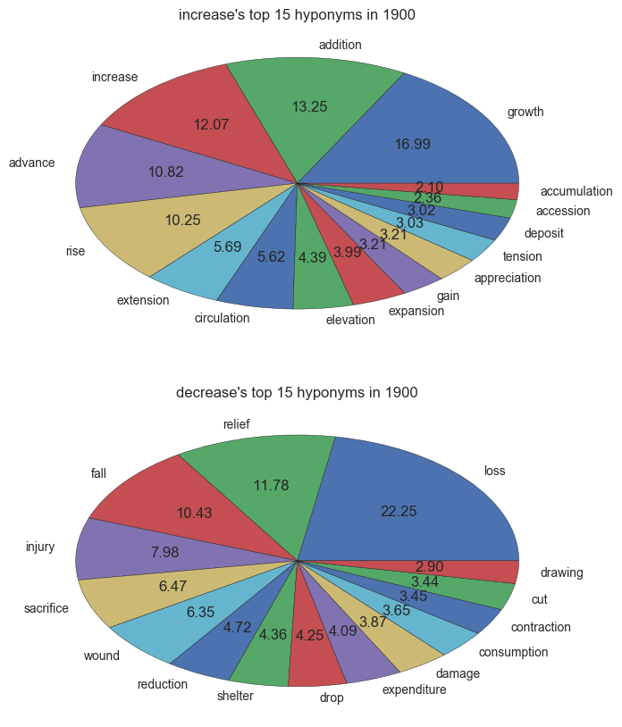
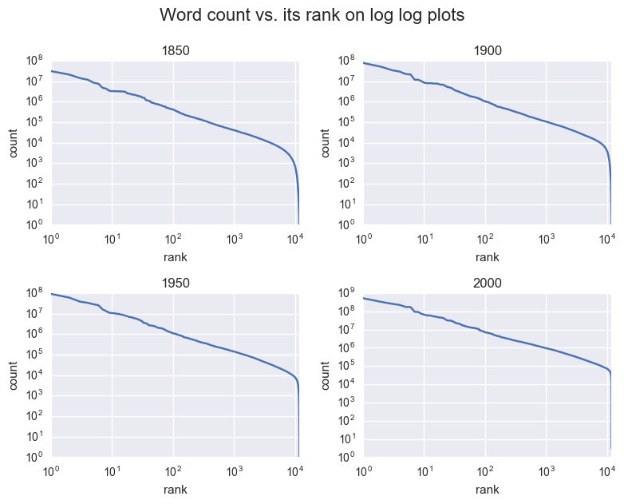
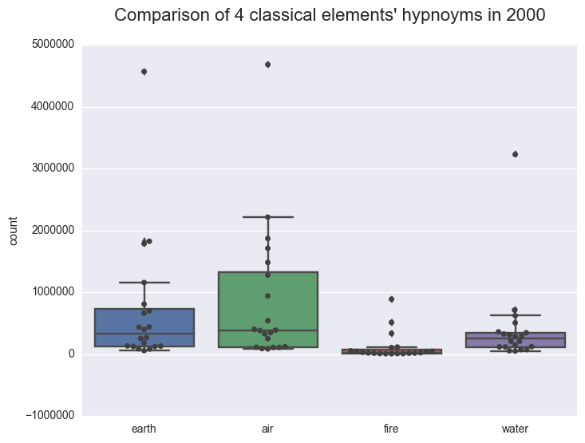

# NGrams and WordNet

<h2>Table of Contents</h2>

<ul>
<li><a href="#sec-1">1. Project structure</a></li>
<li><a href="#sec-2">2. Data</a>
<ul>
<li><a href="#sec-2-1">2.1. NGrams data</a></li>
<li><a href="#sec-2-2">2.2. WordNet data</a></li>
</ul>
</li>
<li><a href="#sec-3">3. Analyses</a>
<ul>
<li><a href="#sec-3-1">3.1. Average word length history</a></li>
<li><a href="#sec-3-2">3.2. socialism vs. capitalism</a></li>
<li><a href="#sec-3-3">3.3. Hyponyms of increase vs. decrease</a></li>
<li><a href="#sec-3-4">3.4. Zipf's Law</a></li>
<li><a href="#sec-3-5">3.5. Four classical elements</a></li>
</ul>
</li>
</ul>

# Project structure

    .
    ├── analysis/
    │   ├── analysis_1.py  ## average word length history
    │   ├── analysis_2.py  ## socialism vs. capitalism history
    │   ├── analysis_3.py  ## hyponyms of increase vs. decrease pie chart
    │   ├── analysis_4.py  ## four classical elements box chart
    │   └── analysis_5.py  ## zipf's law
    │
    ├── analysis_results.ipynb  ## runs the program
    ├── collect_data.sh         ## downloads data
    ├── processing_data.py      ## processes data in raw_data/ and save it to output/
    ├── config.py               ## contains data paths
    │
    ├── ngnet/
    │   ├── ngram.py    ## a class storing NGram data, used in various analyses to access required data fast
    │   ├── digraph.py  ## a directed graph used to maintain synsets' hierarchical structure
    │   └── wordnet.py  ## a class storing WordNet data, mainly used to get all(direct and indirect) hyponyms of a given word
    │
    ├── output/                    ## stores processed data
    │   ├── dummy-mini_ngrams.csv  ## a very small subset of ngrams
    │   ├── ngrams_lower_alpha/    ## lowercase alphabetic nouns in ngrams
    │   ├── ngrams_noun/           ## nouns in ngrams
    │   ├── pics/
    │   ├── total_counts.csv       ## all-time history of ngrams
    │   └── wordnet/               ## wordnet data
    │
    ├── raw_data/
    │   ├── ngrams/
    │   └── wordnet/
    │
    └── tests/

# Data

*All ngrams data pushed to github is dummy data with 10k entries/file since original data is more than 30GB*

## NGrams data

NGrams(1-grams) raw data contains all kinds of words, including nouns, adverbs, adjectives etc. Many words contains special characters.  
The following example: In 1879, the noun "A'Ang", occurred 45 times overall, in 5 distinct books:

    ./raw_data/ngrams/*
    
    | A'Aang_NOUN      | 1879 | 45 | 5 |
    | A'que_ADJ        | 1897 |  7 | 7 |
    | anserinus_NOUN   | 1984 | 44 | 9 |

Noun only ngrams, with their postfixes removed:

    ./output/ngrams_noun/*
    
    | word      | year | count | sources |
    |-----------+------+-------+---------|
    | A'Aang    | 1879 |    45 |       5 |
    | anserinus | 1984 |    44 |       9 |

Lowercase, alphabetic only ngrams:

    ./output/ngrams_lower_alpha/*
    
    | word      | year | count | sources |
    |-----------+------+-------+---------|
    | anserinus | 1984 |    44 |       9 |

total_count.csv records the total number of 1-grams contained in the books.  
The following example: In 2008, 19482936409 words in 108811006 pages from 206272 distinct sources were recorded:

    ./output/total_counts.csv
    
    | year | total_words | pages     | sources |
    |------+-------------+-----------+---------|
    | 2008 | 19482936409 | 108811006 |  206272 |

## WordNet data

All the noun synsets (synonyms) in WordNets:

    ./output/wordnet/synsets.csv
    
    | id | synset               | definition                                                          |
    |----+----------------------+---------------------------------------------------------------------|
    | 36 | AND_circuit AND_gate | a circuit in a computer that fires only when all of its inputs fire |

Hyponyms are more specific synsets. e.g. (change, modification) -> (damage, harm).   
The following example: #32 synset has 5 direct hyponyms which are #77393, #64712, #51671, #37744, #27392:

    ./output/wordnet/hyponyms.csv
    
    | 32 | 77393 | 64712 | 51671 | 37744 | 27392 |

# Analyses

## Average word length history

  
**Observation:**  
The average word length was slowly increasing across the history and reached its peak at 6.947 chars/word in 1979.  

## socialism vs. capitalism

  
**Observation:**  
The two ideology were mentioned most around 1940 and 1980. They are losing momentum quickly in recent years.  

## Hyponyms of increase vs. decrease

  
**Observation:**  
People didn't tend to use "decrease" to express its meanings. It wasn't even among the top 15 of its own hyponyms.  

## Zipf's Law

  
**Observation:**  
All loglog plots show a straight line, which means rank 1 (most popular) word is used twice as often as rank 2 (2nd most popular) word, 3 time as often as rank 3 word etc. It's an interesting observation since the ranking of a word shouldn't have any numerical properties.  

## Four classical elements

  
**Observation:**  
Many words have derived meanings from the 4 classical elements. In 2000 their "strength" is in the order of air > earth > water > fire. Words relating to "fire" is barely used.
